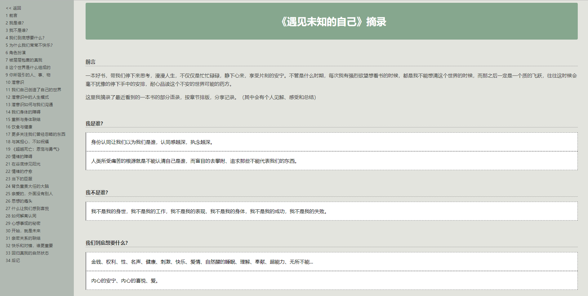
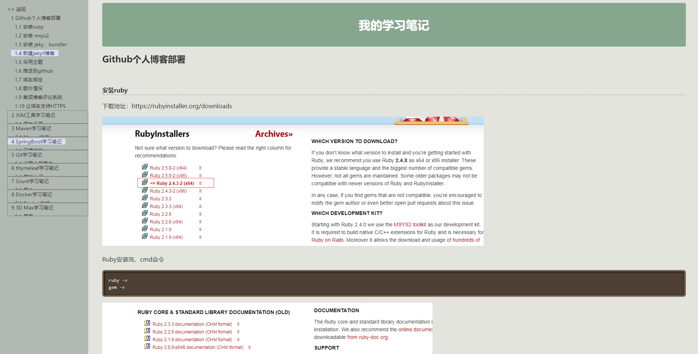

[](https://travis-ci.org/petterobam/my-mds2index.html)
[](https://opensource.org/licenses/mit-license.php)
[](http://github.com/badges/stability-badges)

# my-mds2index.html

多个Markdown文档转化为带索引的单HTML页面

# 使用说明
0. 去relase下载打包好的文件[my-mds2index.htmlv1.0.0.zip](https://github.com/petterobam/my-mds2index.html/releases/download/v1.0.0/my-mds2index.htmlv1.0.0.zip)
1. 将你的markdown文件放入 `markdowns/` 文件夹下面
2. 编辑 `config/config.yml` 将你的markdown文件的文件名按你想要展示的顺序添加到 `markdowns/` 属性下面，添加格式参照你第一次打开看到的格式写法
3. 点击 `my-mds2index.html.exe.bat` 或 `bin/my-mds2index.html.bat`(windows) ；`sh bin/my-mds2index.html.sh` (linux)
4. 你要的单页面索引文件就在 `output/` 文件夹下面

# 扩展使用
1. `template/index.html` 可以修改，自定义生成页面的样式，欢迎 `Pull request` 新样式
2. `config/config.yml` 可以修改，搭配模板
3. 用命令运行 `jar` 可以自定义 ，实现不同模板对应不同配置解析
    ```shell
    java -jar $jar_path $conf_path $mds_path $tpl_path $out_path
    ```
4. 热爱学习的可以自己去发现更多...

# 默认配置文件

```yml
# config/config.yml
page:
  title: 测试多个MarkDown文件生成单页面索引静态HTML文件
  inc: 2018 petterObam
  useArgsPathForJar: true  # 如果设置该配置false，jar文件将完全按照配置文件执行，此时mdBasePath、tplPath、indexPath必填
  mdBasePath:    # markdown文件的目录，默认为 classpath:markdowns/ ，绝对路径
  tplPath:    # index模板文件的路径，默认为 classpath:template/index.html ，绝对路径
  markdowns:
    - 01_getting_started.md
    - 02_code_management_and_deployment.md
    - 03_file.md
    - 04_network.md
    - 05_process.md
    - 06_async_programming.md
    - 07_example.md
  indexPath:  # 生成的index文件输出路径，默认 classpath:output/index.html ，绝对路径
```

# 效果截图

[](http://www.petterobam.cn/reader/meet-unknowed-self/index.html?_blank)

[](http://www.petterobam.cn/learner/index.html?_blank)

# TODO-LIST

1. ~~调试 shell 脚本~~
2. ~~学习完善 bat 脚本~~
